# SnowSQL

>The following will show help commands if run in the terminal by itself:
```console
snowsql
```

>The following are different ways to log in.
>We can supply parameters or edit the config file to avoid params
>>-u = user, -d = database, -s = schema, -r = role, -w = warehouse.
> Use ```CTLR + D``` to exit. 

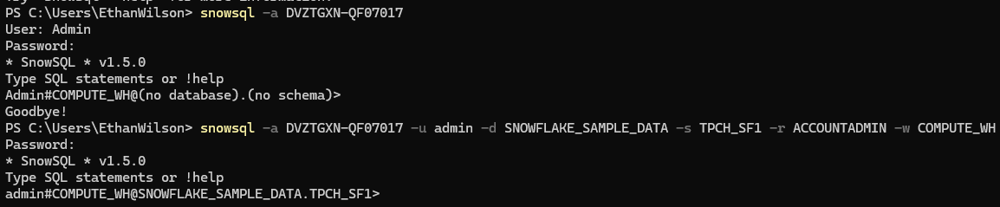

>We can also exit by executing the command with '!' 
>There are many commands.
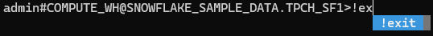

>Here we get our current role, as that isn't displayed in the cli tool

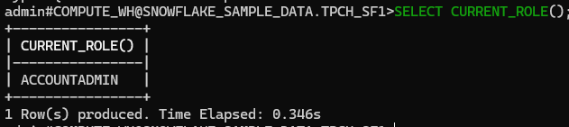

> We use the 'USE' statement as normal to switch roles, schemas, databases, warehouses, etc. 
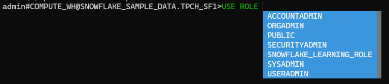

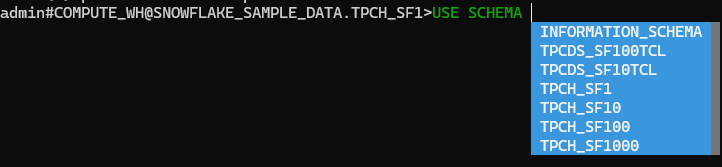

>We can run queries 
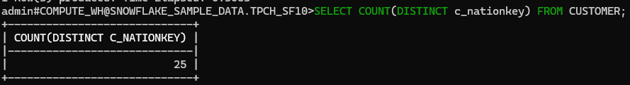

> !help for list of commands
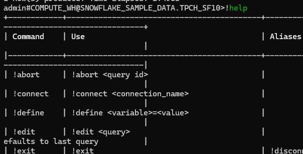

> !options to see our options and current values
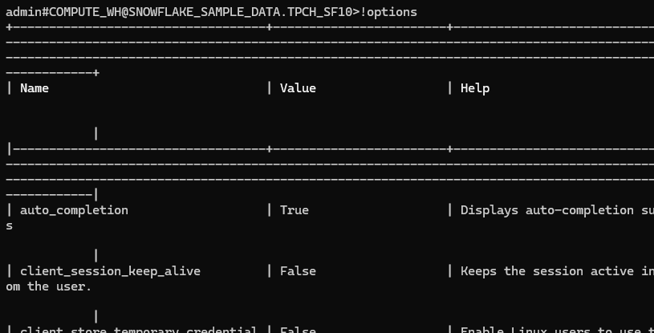

> Here we !set the variable_substitution option to True. This lets us !define variables during sql execution in the cli. 
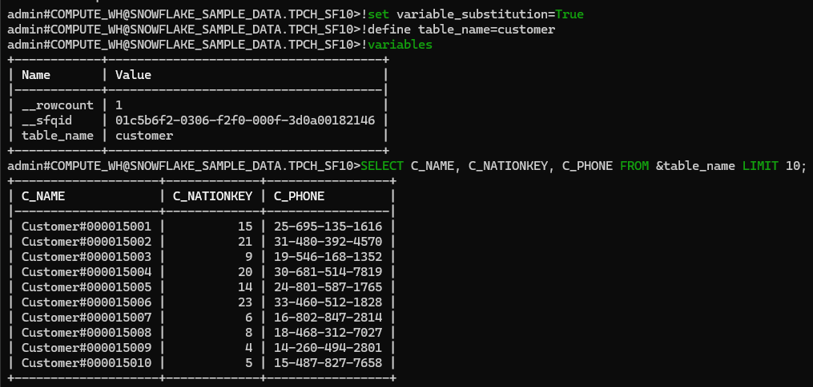

>Next let's create a db, schema, and stage
>Think of a stage as a landing area for data that needs to be processed, more on these later
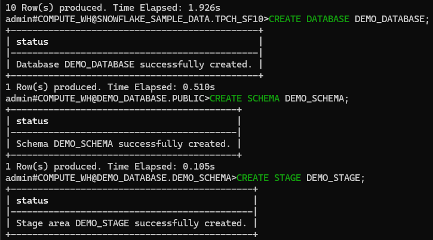

> Here we upload our csv file found in your course materials, we create a table to store the data, and then COPY INTO our new table before querying it to see our results 
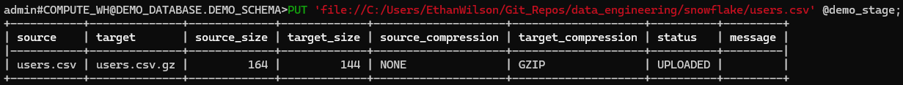
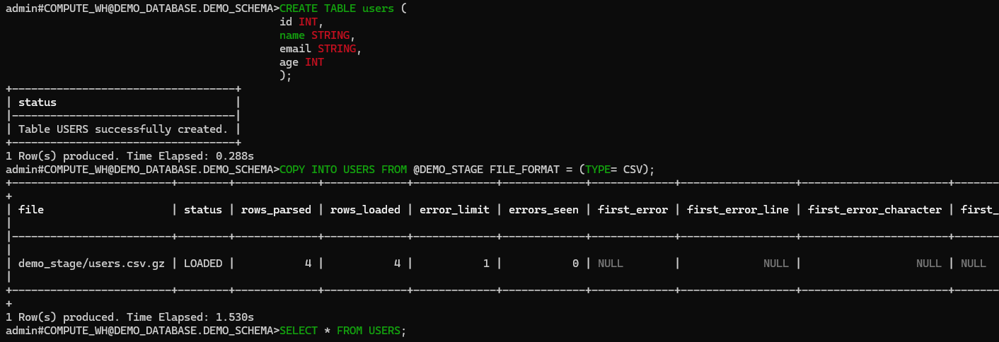
